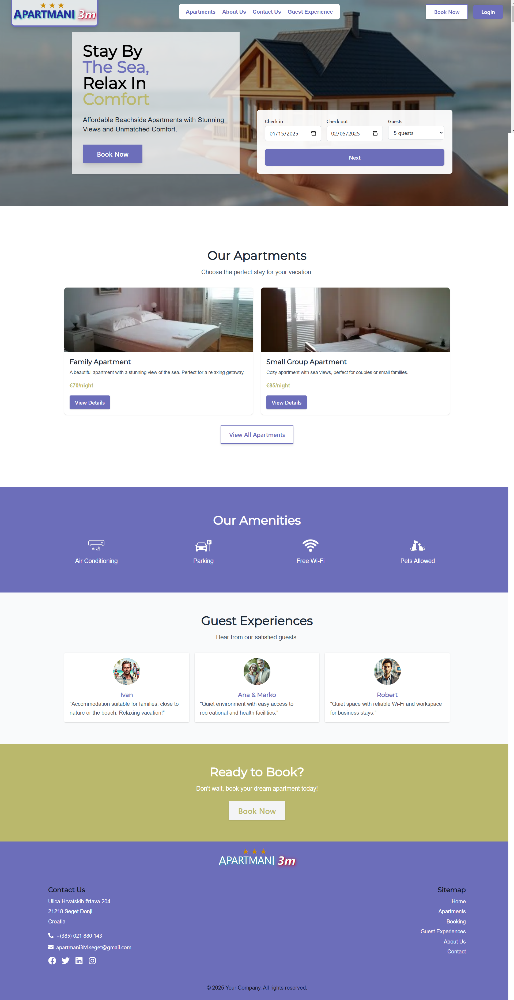
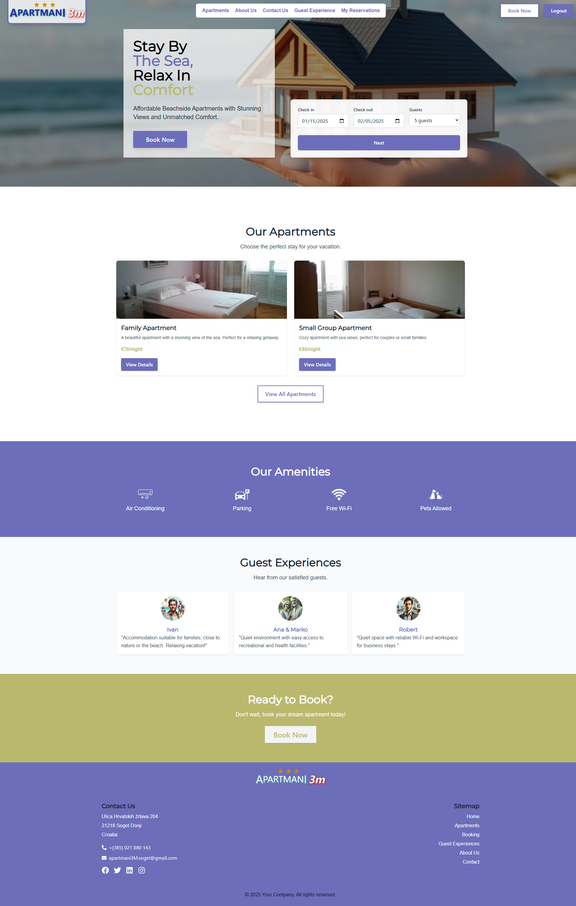
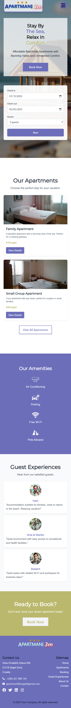
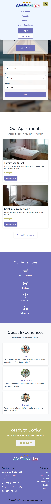

# Full Responsive Landing Page

## Task Description

This project is part of Assignment 6, focusing on developing a fully responsive landing page for a website dedicated to apartments near the sea. The assignment required creating high-fidelity prototypes for both desktop and mobile versions, implementing a responsive design, and ensuring smooth functionality for different screen sizes. Additionally, a mobile-friendly navigation menu was a key requirement.

---

## Developed Features

### 1. Responsive Design
- The landing page is fully responsive, adapting seamlessly to both desktop and mobile devices.
- Optimized layouts ensure that the content remains user-friendly and visually appealing across all screen sizes.

### 2. High-Fidelity Prototypes
- The prototypes were created directly through code instead of using a design tool like Figma.
- Prototypes demonstrate:
  - Desktop version (before and after user login).
  - Mobile version (with hamburger menu closed and open).

### 3. Mobile Navigation Menu
- Implemented a hamburger menu for mobile devices, which toggles between open and closed states.
- Menu includes links for navigating to key sections like Home, About, and Contact.

### 4. Dynamic Login Functionality
- After logging in, users gain access to private content:
  - Manage reservations.
  - View reservation history.
  - Access exclusive information and promotions.

---

## Deliverables

### 1. Prototypes (PNG Format)
Exported PNG files demonstrating the high-fidelity prototypes for both desktop and mobile views:

#### Desktop View
- **Before Login**  
  

- **After Login**  
  

#### Mobile View
- **Hamburger Menu Closed**  
  

- **Hamburger Menu Open**  
  

---

### 2. Deployed Web Application
The landing page is deployed and accessible via the following public URL:  
**[Visit the Landing Page](https://hci-zj6c.vercel.app/)**

---

### Conclusion
This project successfully fulfills all the requirements for Assignment 6 by delivering a responsive and functional landing page. 
The design is optimized for various screen sizes, and the implementation showcases a seamless user experience with dynamic features.