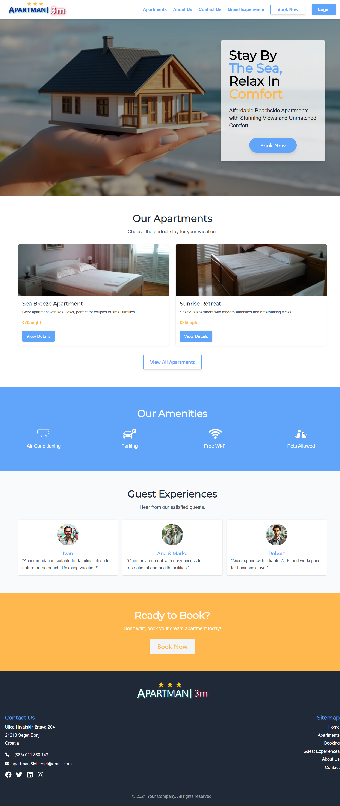
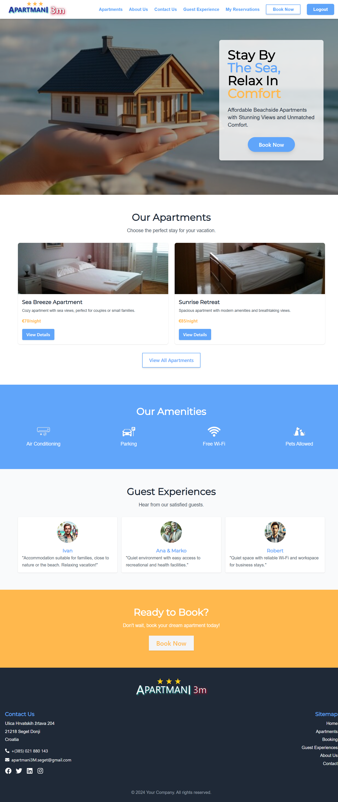

# Low/High-Fidelity Prototype

## Task Description

For this task, I developed a low-fidelity and high-fidelity prototype for a landing page of an apartment website, directly in code (HTML, CSS, JavaScript) instead of using Figma. The focus was on creating a responsive design optimized for both desktop and mobile devices. Additionally, I implemented functionality that changes after the user logs in.

## Developed Features

- **Responsive design**: The page is optimized for both desktop and mobile devices.
- **Login system**: The page allows users to log in. After login, the user is shown specific reservation details.
- **Private content**: After logging in, the user can manage reservations and access exclusive information.

## Deliverables

### Desktop Version (Before Login) & Desktop Version (After Login)

  
  

### Mobile Version (Hamburger Menu Closed) & Mobile Version (Hamburger Menu Open)

  
  

The images are exported in PNG format and included in the repository.

## Conclusion

Although I didn't use Figma for this task, my approach to coding allowed for quick iteration and testing of the design, with functionalities that meet the needs of the users. The page is functional, responsive, and dynamically displays content based on user login.
