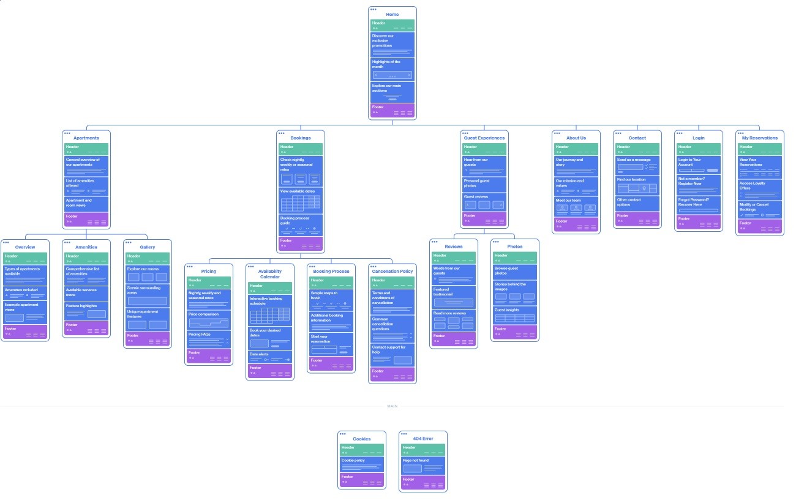

# User personas and information architecture

---
## Contents
1. [Introduction](#introduction)
2. [User Personas](#user-personas)
     - [Persona 1: Local Family on Vacation](#user-persona-1-local-family-on-vacation)
     - [Persona 2: Young couple from EU](#user-persona-2-young-couple-from-eu)
     - [Persona 3: Poslovni Putnik](#user-persona-3-business-traveler)
3. [Information Architecture](#information-architecture)
4. [Sitemap](#sitemap)
5. [Prompts for Generation](#prompts-for-generation)
---

## Introduction
Welcome to the documentation for the apartment website. This site is designed to display key information about the apartments, simplify booking for users, and present different types of guests for whom the accommodation is ideal.
The website was created to provide users with clear and relevant information about apartments, including photos, price lists, amenities and user reviews. The goal is to enable a personalized experience, with ease of navigation and pleasant design, for three main user groups.

---

## User Personas

### User Persona 1: Local Family on vacation

**Demographic data**
- Name: Ivan
- Age: 45
- Occupation: Teacher
- Education: University degree

**Goals and Motivation**
- Ivan wants to find accommodation that is suitable for families, close to nature or the beach, and that allows for a relaxing vacation.

**Challenges and Frustrations**
- It is difficult to find accommodation with family amenities and safety for children.

**Personality and Preferences**
- Values ​​reliability and easy access to reservation information.

---

### User Persona 2: Young Couple from EU

**Demographic data**
- Name: Marie
- Age: 28
- Occupation: Marketing specialist
- Education: Master's degree

**Goals and Motivation**
- Marie wants a romantic getaway with her partner, close to restaurants and cultural locations in Croatia.

**Challenges and Frustrations**
- She needs flexibility when making reservations and clear information about benefits.

**Personality and Preferences**
- Enjoys discovering new destinations and appreciates visually attractive and functional applications.

---

### User Persona 3: Business Traveler

**Demographic data**
- Name: Robert
- Age: 38
- Occupation: Business consultant
- Education: MBA

**Goals and Motivation**
- Robert needs a quiet space with reliable Wi-Fi and a workspace for short business stays.

**Challenges and Frustrations**
- He often needs a quick check-in and check-out due to a strict schedule.

**Personality and Preferences**
- Organized and professional, appreciates the details and functionality of the application.

---

## Information Architecture
The information architecture was created to make it easier for users to navigate through the website and to enable them to easily find the information they need. This structure is based on user needs, identified through user personas.

**Main Categories**

1. **Home Page** 
    - Introduction and description of the apartment
    - Latest promotions or featured benefits
    - User recommendations and reviews
2. **Apartments**
    - Search by guest type (e.g. Family, Couples, Business travelers)
    - Location and views (close to the beach, in nature, sea view)
    - Comforts and facilities (Wi-Fi, air conditioning, work area, kitchen)
    - Image and video gallery
3. **Reservations** 
    - Price list according to season
    - Availability calendar
    - Booking process
    - Cancellation and payment policies
    - Special offers (for certain periods)
4. **Guest Experiences** 
    - User reviews
    - User photos and comments
    - Ratings by category (cleanliness, location, comfort)
5. **About us**
    - A brief history of the apartment and its owner
    - Why choose this particular accommodation?
    - Service philosophy and mission
6. **Contact and Help**
    - Frequently Asked Questions (FAQ)
    - Emergency and customer service numbers
    - Links to social networks
---

## Sitemap
The sitemap for this website was designed to provide an intuitive and user-friendly structure that makes navigation simple and efficient. 
This layout helps users quickly locate the information they need, whether they are exploring apartment options, booking a stay, or learning more about our offerings.

The sitemap includes main sections for Home, Apartments, Bookings, Guest Experiences, About Us, and Contact & Help. 
Each section is organized with subcategories to ensure easy access to detailed information, including amenities, pricing, and reviews.

You can view the full sitemap and structure via the link below:

[Click here to view the complete sitemap on Octopus.do](https://octopus.do/bubz76ow3s)

---

## Prompts for Generation
We used ChatGPT to create user personas and information architecture. The prompts used are:

1. **To create personae**: "Generate user personas for an apartment website with three types of guests: local family, young EU couple and business traveler."
2. **For information architecture and sitemap**: "Create information architecture and sitemap for the apartment website based on user needs."

---

## Conclusion
This documentation describes in detail the user personas, information architecture and sitemap used in the design of the apartment site. The structure is adapted to the needs of the user in order to make the navigation intuitive and the user experience as pleasant as possible.

---